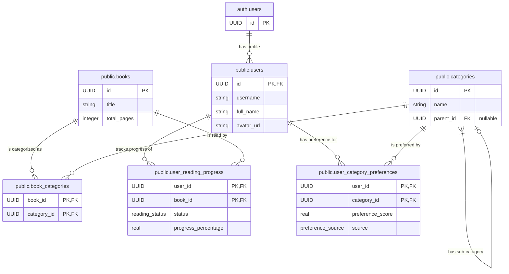

### Part 2: Detailed Database Schema Documentation

Here is the new, detailed markdown file. You should save this as `DATABASE_SCHEMA.md` in the root of your project repository.

**(Start of DATABASE_SCHEMA.md)**

# Database Schema Documentation

This document provides a detailed technical reference for the project's PostgreSQL database schema, managed by Supabase. It includes table structures, custom types, functions, and triggers.

## Schema Diagram (ERD)

This diagram illustrates the relationships between the core tables in our database.



## Custom Types

We use custom `ENUM` types to ensure data consistency for specific fields.

### `reading_status`

* **Description:** Represents the user's current status for a book in their library.
* **SQL Definition:**
  ```sql
  CREATE TYPE reading_status AS ENUM ('to_read', 'reading', 'finished', 'abandoned');
  ```

### `preference_source`

* **Description:** Records the origin of a user's preference score for a category. This helps distinguish between what the user stated and what our system inferred.
* **SQL Definition:**
  ```sql
  CREATE TYPE preference_source AS ENUM ('onboarding', 'explicit_follow', 'implicit_interaction');
  ```

---

## Table Definitions

### `public.users`

* **Description:** Stores public profile information for each application user. Each record is directly linked to a user in Supabase's `auth.users` table.
* **Columns:**| Column         | Type            | Constraints                                    | Description                                                        |
  | :------------- | :-------------- | :--------------------------------------------- | :----------------------------------------------------------------- |
  | `id`         | `UUID`        | `PRIMARY KEY`, `REFERENCES auth.users(id)` | The user's unique identifier. Must match the ID in `auth.users`. |
  | `created_at` | `TIMESTAMPTZ` | `NOT NULL`, `DEFAULT NOW()`                | Timestamp of when the user profile was created.                    |
  | `updated_at` | `TIMESTAMPTZ` | `NOT NULL`, `DEFAULT NOW()`                | Timestamp of the last profile update.                              |
  | `username`   | `TEXT`        | `UNIQUE`                                     | The user's unique, public username.                                |
  | `full_name`  | `TEXT`        |                                                | The user's full name.                                              |
  | `avatar_url` | `TEXT`        |                                                | URL to the user's profile picture.                                 |
* **SQL Definition:**
  ```sql
  CREATE TABLE public.users (
    id UUID PRIMARY KEY NOT NULL REFERENCES auth.users(id) ON DELETE CASCADE,
    created_at TIMESTAMPTZ NOT NULL DEFAULT NOW(),
    updated_at TIMESTAMPTZ NOT NULL DEFAULT NOW(),
    username TEXT UNIQUE,
    full_name TEXT,
    avatar_url TEXT,
    CONSTRAINT username_length CHECK (char_length(username) >= 3)
  );

  ALTER TABLE public.users ENABLE ROW LEVEL SECURITY;
  ```

### `public.categories`

* **Description:** A hierarchical table for all content categories. A category with a `NULL` `parent_id` is a main category.
* **Columns:**| Column          | Type            | Constraints                                    | Description                                             |
  | :-------------- | :-------------- | :--------------------------------------------- | :------------------------------------------------------ |
  | `id`          | `UUID`        | `PRIMARY KEY`, `DEFAULT gen_random_uuid()` | Unique identifier for the category.                     |
  | `name`        | `TEXT`        | `NOT NULL`                                   | The display name of the category.                       |
  | `description` | `TEXT`        |                                                | A brief description of the category.                    |
  | `parent_id`   | `UUID`        | `REFERENCES public.categories(id)`           | Foreign key to itself, identifying the parent category. |
  | `created_at`  | `TIMESTAMPTZ` | `NOT NULL`, `DEFAULT NOW()`                | Timestamp of creation.                                  |
* **SQL Definition:**
  ```sql
  CREATE TABLE public.categories (
    id UUID PRIMARY KEY DEFAULT gen_random_uuid(),
    name TEXT NOT NULL,
    description TEXT,
    parent_id UUID REFERENCES public.categories(id) ON DELETE CASCADE,
    created_at TIMESTAMPTZ NOT NULL DEFAULT NOW(),
    UNIQUE (parent_id, name)
  );

  ALTER TABLE public.categories ENABLE ROW LEVEL SECURITY;
  CREATE POLICY "Allow public read access to categories" ON public.categories FOR SELECT USING (true);
  ```

### `public.books`

* **Description:** The master catalog of all books in the system.
* **Columns:**| Column              | Type            | Constraints                                    | Description                                     |
  | :------------------ | :-------------- | :--------------------------------------------- | :---------------------------------------------- |
  | `id`              | `UUID`        | `PRIMARY KEY`, `DEFAULT gen_random_uuid()` | Unique identifier for the book.                 |
  | `title`           | `TEXT`        | `NOT NULL`                                   | The title of the book.                          |
  | `author`          | `TEXT`        |                                                | The author of the book.                         |
  | `total_pages`     | `INT`         |                                                | Total number of pages in the book.              |
  | `cover_image_url` | `TEXT`        |                                                | URL for the book's cover image.                 |
  | `description`     | `TEXT`        |                                                | A synopsis or description of the book.          |
  | `published_date`  | `DATE`        |                                                | The original publication date.                  |
  | `created_at`      | `TIMESTAMPTZ` | `NOT NULL`, `DEFAULT NOW()`                | Timestamp of when the book was added to the DB. |
* **SQL Definition:**
  ```sql
  CREATE TABLE public.books (
    id UUID PRIMARY KEY DEFAULT gen_random_uuid(),
    title TEXT NOT NULL,
    author TEXT,
    total_pages INT,
    cover_image_url TEXT,
    description TEXT,
    published_date DATE,
    created_at TIMESTAMPTZ NOT NULL DEFAULT NOW()
  );

  ALTER TABLE public.books ENABLE ROW LEVEL SECURITY;
  CREATE POLICY "Allow authenticated read access to books" ON public.books FOR SELECT USING (auth.role() = 'authenticated');
  ```

### `public.book_categories`

* **Description:** A many-to-many join table linking `books` to the `categories` they belong to.
* **Columns:**| Column          | Type     | Constraints                                           | Description                  |
  | :-------------- | :------- | :---------------------------------------------------- | :--------------------------- |
  | `book_id`     | `UUID` | `PRIMARY KEY`, `REFERENCES public.books(id)`      | Foreign key to the book.     |
  | `category_id` | `UUID` | `PRIMARY KEY`, `REFERENCES public.categories(id)` | Foreign key to the category. |
* **SQL Definition:**
  ```sql
  CREATE TABLE public.book_categories (
    book_id UUID NOT NULL REFERENCES public.books(id) ON DELETE CASCADE,
    category_id UUID NOT NULL REFERENCES public.categories(id) ON DELETE CASCADE,
    PRIMARY KEY (book_id, category_id)
  );

  ALTER TABLE public.book_categories ENABLE ROW LEVEL SECURITY;
  CREATE POLICY "Allow public read access to book-category links" ON public.book_categories FOR SELECT USING (true);
  ```

### `public.user_reading_progress`

* **Description:** Tracks the raw behavioral data of a user's interaction with a book. This is the primary input for the personalization engine.
* **Columns:**| Column                      | Type               | Constraints                                      | Description                                               |
  | :-------------------------- | :----------------- | :----------------------------------------------- | :-------------------------------------------------------- |
  | `user_id`                 | `UUID`           | `PRIMARY KEY`, `REFERENCES public.users(id)` | Foreign key to the user.                                  |
  | `book_id`                 | `UUID`           | `PRIMARY KEY`, `REFERENCES public.books(id)` | Foreign key to the book.                                  |
  | `status`                  | `reading_status` | `NOT NULL`, `DEFAULT 'to_read'`              | The user's current reading status for this book.          |
  | `progress_percentage`     | `REAL`           | `NOT NULL`, `DEFAULT 0`                      | Reading progress, from 0 to 100.                          |
  | `started_reading_at`      | `TIMESTAMPTZ`    |                                                  | Timestamp of when the user started reading.               |
  | `finished_reading_at`     | `TIMESTAMPTZ`    |                                                  | Timestamp of when the user finished the book.             |
  | `last_progress_update_at` | `TIMESTAMPTZ`    | `NOT NULL`, `DEFAULT NOW()`                  | Timestamp of the last interaction. Vital for decay logic. |
* **SQL Definition:**
  ```sql
  CREATE TABLE public.user_reading_progress (
    user_id UUID NOT NULL REFERENCES public.users(id) ON DELETE CASCADE,
    book_id UUID NOT NULL REFERENCES public.books(id) ON DELETE CASCADE,
    status reading_status NOT NULL DEFAULT 'to_read',
    progress_percentage REAL NOT NULL DEFAULT 0 CHECK (progress_percentage >= 0 AND progress_percentage <= 100),
    started_reading_at TIMESTAMPTZ,
    finished_reading_at TIMESTAMPTZ,
    last_progress_update_at TIMESTAMPTZ NOT NULL DEFAULT NOW(),
    PRIMARY KEY (user_id, book_id)
  );

  ALTER TABLE public.user_reading_progress ENABLE ROW LEVEL SECURITY;
  CREATE POLICY "Users can manage their own reading progress" ON public.user_reading_progress FOR ALL USING (auth.uid() = user_id) WITH CHECK (auth.uid() = user_id);
  ```

### `public.user_category_preferences`

* **Description:** Stores the computed personalization scores for each user and category. This table is primarily written to by the background personalization engine and read by the application to generate recommendations.
* **Columns:**| Column               | Type                  | Constraints                                           | Description                                             |
  | :------------------- | :-------------------- | :---------------------------------------------------- | :------------------------------------------------------ |
  | `user_id`          | `UUID`              | `PRIMARY KEY`, `REFERENCES public.users(id)`      | Foreign key to the user.                                |
  | `category_id`      | `UUID`              | `PRIMARY KEY`, `REFERENCES public.categories(id)` | Foreign key to the category.                            |
  | `preference_score` | `REAL`              | `NOT NULL`, `DEFAULT 0.5`                         | A normalized score (0.0 to 1.0) of the user's interest. |
  | `source`           | `preference_source` | `NOT NULL`                                          | The origin of the current preference score.             |
  | `updated_at`       | `TIMESTAMPTZ`       | `NOT NULL`, `DEFAULT NOW()`                       | Timestamp of the last score update.                     |
* **SQL Definition:**
  ```sql
  CREATE TABLE public.user_category_preferences (
    user_id UUID NOT NULL REFERENCES public.users(id) ON DELETE CASCADE,
    category_id UUID NOT NULL REFERENCES public.categories(id) ON DELETE CASCADE,
    preference_score REAL NOT NULL CHECK (preference_score >= 0.0 AND preference_score <= 1.0) DEFAULT 0.5,
    source preference_source NOT NULL,
    updated_at TIMESTAMPTZ NOT NULL DEFAULT NOW(),
    PRIMARY KEY (user_id, category_id)
  );

  ALTER TABLE public.user_category_preferences ENABLE ROW LEVEL SECURITY;
  CREATE POLICY "Users can manage their own preference data" ON public.user_category_preferences FOR ALL USING (auth.uid() = user_id) WITH CHECK (auth.uid() = user_id);
  ```

---

## Functions and Triggers

### `handle_new_user()` and `on_auth_user_created`

* **Purpose:** This function and trigger pair form an essential bridge between Supabase's authentication system and our application's data. They ensure that for every new user who signs up, a corresponding profile record is automatically and atomically created in the `public.users` table.
* **Execution:** The `on_auth_user_created` trigger fires `AFTER` any new `INSERT` into the `auth.users` table. It then calls the `handle_new_user()` function.
* **Key Logic:** The function runs with `SECURITY DEFINER` privileges, allowing it to bypass RLS to insert the new row. It takes the `id` from the newly created `auth.users` record (available as `new.id`) and uses it as the primary key for the new record in `public.users`.
* **SQL Definition:**
  ```sql
  -- 1. Create the function to be called by the trigger.
  CREATE OR REPLACE FUNCTION public.handle_new_user()
  RETURNS TRIGGER
  LANGUAGE plpgsql
  SECURITY DEFINER
  AS $$
  BEGIN
    -- Insert a new row into public.users, using the ID from the new auth user.
    INSERT INTO public.users (id)
    VALUES (new.id);

    RETURN new;
  END;
  $$;

  -- 2. Create the trigger that fires after a new user is inserted into auth.users.
  CREATE TRIGGER on_auth_user_created
    AFTER INSERT ON auth.users
    FOR EACH ROW
    EXECUTE FUNCTION public.handle_new_user();
  ```

**(End of DATABASE_SCHEMA.md)**
